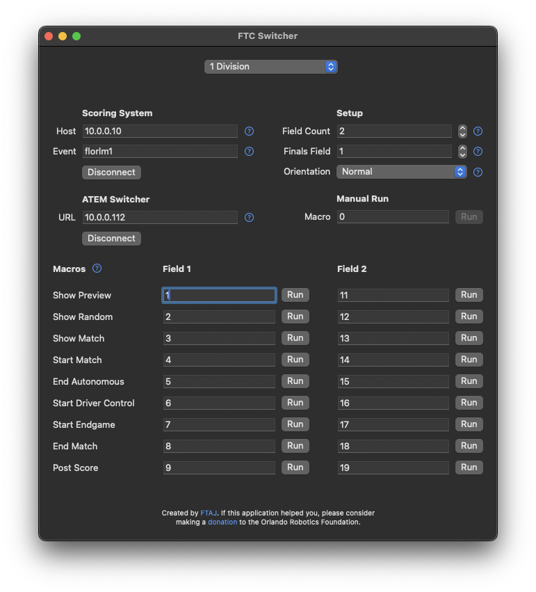

# FTC Switcher

_Automate video switching for FIRST Tech Challenge competitions_

---

Have you ever needed something so niche that you just have to build it yourself?
This is one of those projects.

[_FIRST®_ Tech Challenge](https://www.firstinspires.org/robotics/ftc) is an educational program where students in grades 7–12 design, build, program, and operate robots to compete in a head-to-head challenge in an alliance format.
_FIRST®_ Tech Challenge competitions are celebrations of the students' hard work and involve a variety of technology and technical volunteers.
Some competitions are live-streamed to the world, often using [video switchers created by Blackmagic Design](https://www.blackmagicdesign.com/products/atemmini).

This macOS application communicates with the [_FIRST®_ Tech Challenge scoring system](https://github.com/FIRST-Tech-Challenge/scorekeeper) (the software that starts and stops matches and announces scores) to learn when certain events occur.
Then it issues commands (macros) to a connected Blackmagic Design ATEM video switcher.
The result?
Automatically change between cameras, keys, and other settings when matches start, scores are announced, etc.

It's a hands-free way to keep live video feeds relevant during a competition.



## Installation

_To be determined_

In order to use this application, you must also have the [ATEM Switchers software](https://www.blackmagicdesign.com/support/family/atem-live-production-switchers) available from Blackmagic Design.
Specifically, the application requires the following library bundle to exist:

```
/Library/Application Support/Blackmagic Design/Switchers/BMDSwitcherAPI.bundle
```

> **Note**
> Check the release notes of each version of this application for notes about which versions of the ATEM Switchers software are compatible.

## Usage

Using this application requires some setup before the day of the competition.
Here's an overview of the necessary setup:

1. FTC Switcher running on a macOS computer (the "controller")
2. FTC Scoring software running on the same network as the controller (or on the controller itself)
3. ATEM video switcher running on the same network as the switcher (or plugged in via USB to the controller itself)
4. Macros saved on the ATEM video switcher

It's important to understand that this application doesn't know anything about video switching — all it knows how to do is issue a numbered macro to a connected ATEM switcher.
Therefore, it's necessary to set up those macros ahead of time.
See the **Example** below for more information.

## Example

Imagine you're using an ATEM Mini with four video inputs:

1. Camera focused on Field 1
2. Camera focused on Field 2
3. Wide-shot camera
4. Scoring software display in "overlay" mode

We want to show field 1 when a match is playing on field 1, show field 2 when a match is playing there, and show the wide view otherwise. Here's a set of macros that can help accomplish that:

```xml
<?xml version="1.0" encoding="UTF-8"?>
<Profile majorVersion="2" minorVersion="1" product="ATEM Mini">
    <MacroPool>
        <Macro index="0" name="Field 1" description="Field 1 with Overlay">
            <Op id="KeyType" mixEffectBlockIndex="0" keyIndex="0" type="Chroma"/>
            <Op id="KeyFillInput" mixEffectBlockIndex="0" keyIndex="0" input="Camera4"/>
            <Op id="AdvancedChromaKeySamplingModeEnabled" mixEffectBlockIndex="0" keyIndex="0" enabled="True"/>

            <Op id="ProgramInput" mixEffectBlockIndex="0" input="Camera1"/>
            <Op id="KeyOnAir" mixEffectBlockIndex="0" keyIndex="0" onAir="True"/>
        </Macro>
        <Macro index="1" name="Field 2" description="Field 2 with Overlay">
            <Op id="KeyType" mixEffectBlockIndex="0" keyIndex="0" type="Chroma"/>
            <Op id="KeyFillInput" mixEffectBlockIndex="0" keyIndex="0" input="Camera4"/>
            <Op id="AdvancedChromaKeySamplingModeEnabled" mixEffectBlockIndex="0" keyIndex="0" enabled="True"/>

            <Op id="ProgramInput" mixEffectBlockIndex="0" input="Camera2"/>
            <Op id="KeyOnAir" mixEffectBlockIndex="0" keyIndex="0" onAir="True"/>
        </Macro>
        <Macro index="2" name="Wide Overlay" description="Wide camera with Overlay">
            <Op id="KeyType" mixEffectBlockIndex="0" keyIndex="0" type="Chroma"/>
            <Op id="KeyFillInput" mixEffectBlockIndex="0" keyIndex="0" input="Camera4"/>
            <Op id="AdvancedChromaKeySamplingModeEnabled" mixEffectBlockIndex="0" keyIndex="0" enabled="True"/>

            <Op id="ProgramInput" mixEffectBlockIndex="0" input="Camera3"/>
            <Op id="KeyOnAir" mixEffectBlockIndex="0" keyIndex="0" onAir="True"/>
        </Macro>
        <Macro index="3" name="Wide no Overlay" description="Wide camera without Overlay">
            <Op id="ProgramInput" mixEffectBlockIndex="0" input="Camera3"/>
            <Op id="KeyOnAir" mixEffectBlockIndex="0" keyIndex="0" onAir="False"/>
        </Macro>
    </MacroPool>
    <MacroControl loop="False"/>
</Profile>
```

> **Note**
> You can use the ATEM Switchers software to record, load, and save macros in XML format like you see above.

Breaking this down, we have four macros:

1. Input 1 (to show field 1) with the scoring overlay on
2. Input 2 (to show field 2) with the scoring overlay on
3. Input 3 (for the wide shot) with the scoring overlay on
4. Input 3 (for the wide shot) with the scoring overlay off

The screenshot above provides a likely setup for the application in this scenario:

* Scoring host is `localhost` if the scoring software is running on the same computer
* Scoring event is `usflors` (yours will be different)
* Switcher host is blank to connect via USB
* Send macro `4` when showing the preview of a match — this is usually an intermediate period between matches and well-served by a wide view with no scoring overlay
* Send macro `3` when the scorekeeper presses "show match" — this is usually done when the teams are about ready to start, so it's time to introduce the scoring overlay
* Send macro `1` or `2` when the match begins, depending on which field is active
* Send macro `4` when the match ends — this clears the scoring overlay, so viewers won't see any updates to the live scoring until the final scores are announced
* Send macro `3` when scores are posted — this will show the full-screen score announcement overlay atop the wide shot

There are many ways to set up cameras at a tournament, and many ways to make the video more interesting.
Explore what's possible using various types of keys, media, and effects — as long as you can save a macro for it, you can trigger it automatically.

## Acknowledgments

Blackmagic Design and Blackmagic are trademarks of Blackmagic Design Pty. Ltd., registered in the USA and other countries.
This project is not affiliated with Blackmagic Design Pty. Ltd. and they provide no warranty or support.

_FIRST®_ and _FIRST®_ Tech Challenge (formerly also known as FTC®) are trademarks of For Inspiration and Recognition of Science and Technology (_FIRST®_).
This project is not affiliated with _FIRST®_ and _FIRST®_ provides no warranty or support.

This project was made possible thanks to education and contributions from many Florida-based _FIRST®_ Tech Challenge volunteers.
Special thanks to Mike Walker, Andrew Rudolph, and Tyler Coleman.
